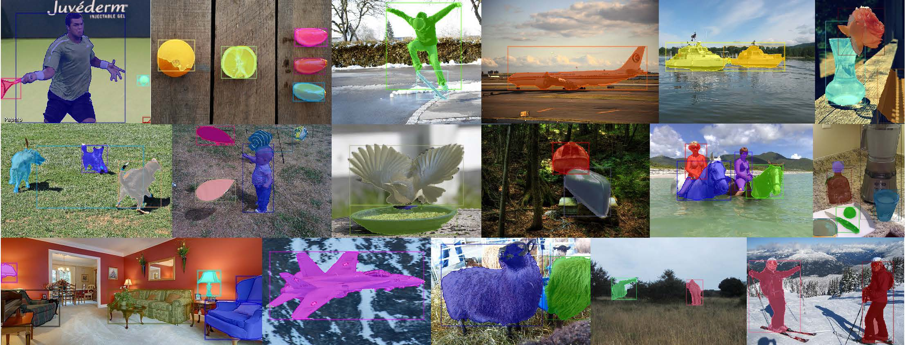

# FreeSOLO: Learning to Segment Objects without Annotations

This project hosts the code for implementing the FreeSOLO algorithm for unsupervised instance segmentation.

> [**FreeSOLO: Learning to Segment Objects without Annotations**](https://arxiv.org/abs/2202.12181),  
> Xinlong Wang, Zhiding Yu, Shalini De Mello, Jan Kautz, Anima Anandkumar, Chunhua Shen, Jose M. Alvarez  
> In: Proc. IEEE Conf. Computer Vision and Pattern Recognition (CVPR), 2022  
> *arXiv preprint ([arXiv 2202.12181](https://arxiv.org/abs/2202.12181))*  


## Visual Results




## Installation

### Prerequisites

- Linux or macOS with Python >= 3.6
- PyTorch >= 1.5 and torchvision that matches the PyTorch installation.
- scikit-image

### Install PyTorch in Conda env

```shell
# create conda env
conda create -n detectron2 python=3.6
# activate the enviorment
conda activate detectron2
# install PyTorch >=1.5 with GPU
conda install pytorch torchvision -c pytorch
```

### Build Detectron2 from Source

Follow the [INSTALL.md](https://github.com/facebookresearch/detectron2/blob/master/INSTALL.md) to install Detectron2 (commit id [11528ce](https://github.com/facebookresearch/detectron2/tree/11528ce083dc9ff83ee3a8f9086a1ef54d2a402f) has been tested).


### Datasets

Follow the [datasets/README.md](https://github.com/facebookresearch/detectron2/blob/master/datasets/README.md) to set up the MS COCO dataset.

### Pre-trained model

Download the [DenseCL](https://github.com/WXinlong/DenseCL) pre-trained model from [here](https://cloudstor.aarnet.edu.au/plus/s/hdAg5RYm8NNM2QP/download). Convert it to detectron2's format and put the converted model under "training_dir/pre-trained/DenseCL" directory.

```shell
python tools/convert-pretrain-to-detectron2.py {WEIGHT_FILE}.pth {WEIGHT_FILE}.pkl
```


## Usage

### Free Mask
Download the prepared free masks in json format from [here](https://cloudstor.aarnet.edu.au/plus/s/AGcBm8cbqTWEKRS/download). Put it under "datasets/coco/annotations" directory. Or, generate it by yourself:

```shell
bash inference_freemask.sh
```

### Training

```shell
# train with free masks
bash train.sh

# generate pseudo labels
bash gen_pseudo_labels.sh

# self-train
bash train_pl.sh
```

### Testing
Download the trained model from [here](https://cloudstor.aarnet.edu.au/plus/s/V8C0onE5H63x3RD/download).

```shell
bash test.sh {MODEL_PATH}
```


## Citations
Please consider citing our paper in your publications if the project helps your research. BibTeX reference is as follow.
```BibTeX
@article{wang2022freesolo,
  title={FreeSOLO: Learning to Segment Objects without Annotations},
  author={Wang, Xinlong and Yu, Zhiding and De Mello, Shalini and Kautz, Jan and Anandkumar, Anima and Shen, Chunhua and Alvarez, Jose M},
  journal={arXiv preprint arXiv:2202.12181},
  year={2022}
}

```
